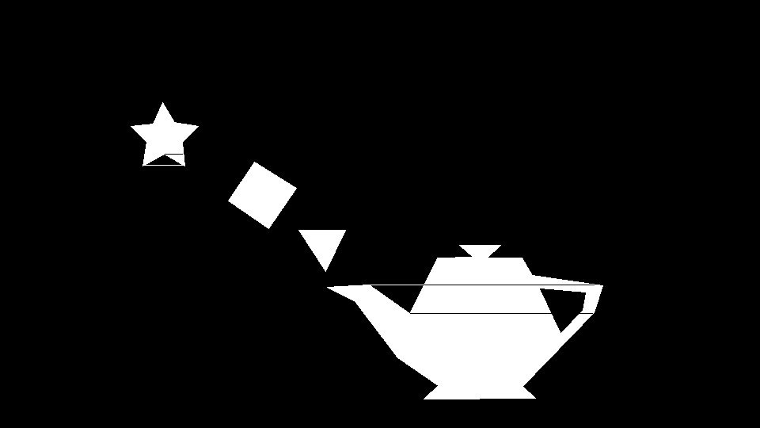

# Laboratorio 1
## Autor: José Mérida - Carné 201105
### Instrucciones
Para el laboratorio de hoy, deben crear un algoritmo que pueda rellenar polígonos de más de 4 puntos. Les recomiendo empezar dibujando las líneas entre los puntos para que puedan entender mejor la imágenes.

No pueden usar librerías externas.
```
Poligono 1:
(165, 380) (185, 360) (180, 330) (207, 345) (233, 330) (230, 360) (250, 380) (220, 385) (205, 410) (193, 383)
```
```
Poligono 2:
(321, 335) (288, 286) (339, 251) (374, 302)
```
```
Poligono 3:
(377, 249) (411, 197) (436, 249)
```
```
Poligono 4:
(413, 177) (448, 159) (502, 88) (553, 53) (535, 36) (676, 37) (660, 52) (750, 145) (761, 179) (672, 192) (659, 214)
(615, 214) (632, 230) (580, 230) (597, 215) (552, 214) (517, 144) (466, 180)
```
```
Poligono 5:
(682, 175) (708, 120) (735, 148) (739, 170)
```
### Resultado

### Algoritmo Utilizado
Este programa implementa una versión del algoritmo Scanline que funciona de la siguiente manera:
- Se trazan los bordes del polígono
- Se encuentran los valores máximos y mínimos de coordenadas X y Y para el polígono utilizando los puntos dados
- Se crea un "Boundry Box" para poder recorrer todos los posibles puntos que puedan estar dentro del polígono según las coordenadas máximas
- Se evalua si cada punto se encuentra dentro del polígono siguiendo un algoritmo Ray-Casting, de estarlo colorea el punto

Algoritmo Ray-Casting:

Este algoritmo traza una línea desde un punto en específico hacia la derecha y dependiendo de la cantidad de bordes que se crucen se determina si se encuentra dentro del polígono o no
- Se recorre el set de coordenadas de los puntos del polígono
- Se determina si la coordenada Y del punto se encuentra entre el Ymin y Ymax del borde
- Se determina si la coordenada X del punto se encuentra hacia el lado izquierdo de la coordenada X máxima del borde
- De cumplir las condiciones anteriores, se calcula el intercepto en X del borde
- Si X es menor a este intercepto (se encuentra a la izquierda) se da la vuelta a un valor booleano inicialmente false
- El retorno de este booleano identifica correctamente si el punto se encuentra dentro o fuera del polígono
